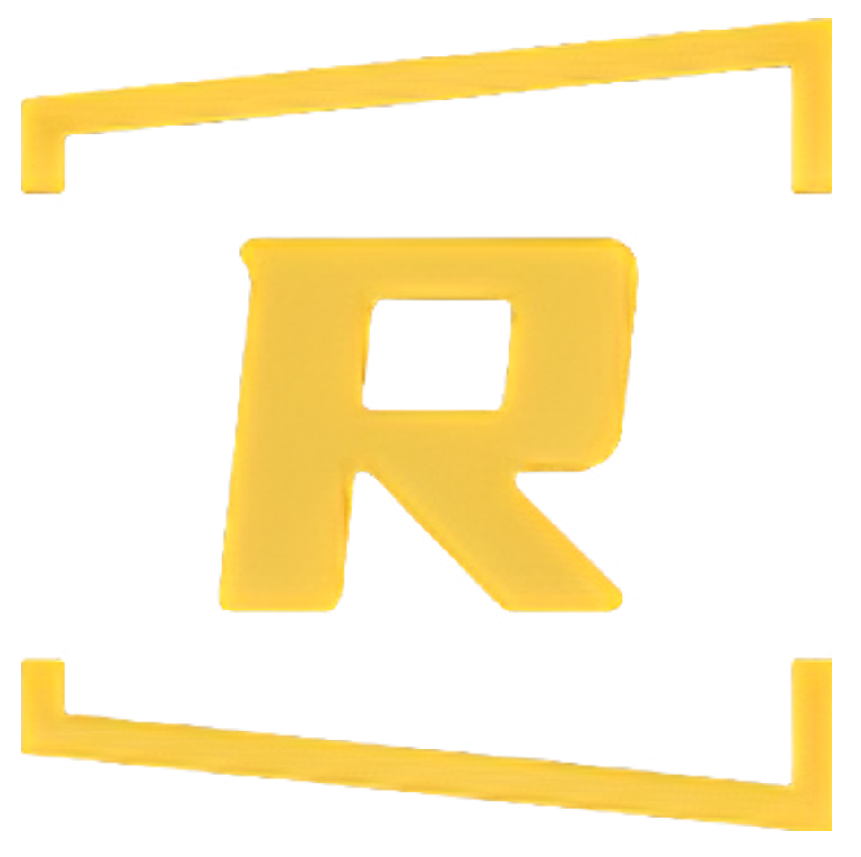

<p align="center">
    

<h1 align="center">rstar-ui</h1>

<p align="center">A Component Library for Vue 3</p>

<p align="center">
    <a href="javascript:void(0)" target="_blank">document</a>
</p>

## Features

- 🚀 Provides UnoCSS preset package.
- 🚀 Use attribute mode like unocss to design.

## Install

```bash
npm i rstar-ui @rsatar-preset -S
```

## Quick Start

```js
// unocss.config.js
import { defineConfig, presetIcons, presetAttributify, presetUno } from 'unocss'
import presetRStar from '@rstar-ui/preset'

export default defineConfig({
  presets: [presetUno(), presetAttributify(), presetIcons(), presetRStar()]
})
```

```js
// vite.config.js
import { defineConfig } from 'vite'
import vue from '@vitejs/plugin-vue'
import Unocss from 'unocss/vite'

// https://vitejs.dev/config/
export default defineConfig({
  plugins: [vue(), Unocss()]
})
```

## LICENSE
[MIT](./LICENSE)